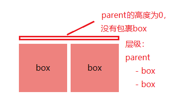

# CSS技巧和经验

### 1. 行内块元素(img、a等)之间(水平、垂直)产生的几像素间距问题

+ 分析：

     

+ 方法1：解决垂直间距问题。行内块元素设置 ```display:block;```

+ 方法2：解决垂直间距问题。行内块元素设置 ```vertical-align:top;```

+ 方法3：(**不推荐**) 解决水平间距问题。去掉html的行内块元素之间的空格，使它们紧挨着，或者将之间空格进行注释。缺点是影响阅读，不优雅
    
    ```
    <!-- HTML -->
    <div>
        <span>box</span><span>box</span>
    </div>
    <!-- 或者 -->
    <div>
        <span>box</span><!--
        --><span>box</span>
    </div>
    ```

+ 方法4：(**推荐**) 同时解决垂直间距和水平间距。行内块元素的父容器设置 ```font-size:0;```。因为属性可继承性，行内块元素内部样式需要重设其值

+ 方法5：(**不推荐**) 行内块元素的父容器的 ```word-spacing```(字间距)或```letter-spacing```(字符间距)设置成负X值(X：不同浏览器不同值)。因为属性可继承性，行内块元素需要重设其值为0

---

### 2. 清除列表每行最右侧项的右边距

+ 效果：
    
    

+ 方法1：(**推荐**) ul容纳li，ul的父级再把ul多出的最右边的边距给隐藏掉：
使用```overflow:hidden```(ul闭合浮动和ul的父级超出隐藏)配合直接增加ul宽度(使用负边距的方式也能够增加宽度，原因请看本文中的 CSS 负边距)。缺点是3层结构且需要设置多一层宽度。优点是无兼容性问题

    + 分析：
    
        

    + 代码：

        ```
        /* CSS */
        .test {
            width: 320px;
            overflow: hidden; /* 超出隐藏 */
        }

        .test ul {
            width: 330px; /* 增加宽度 */
            overflow: hidden; /* 闭合浮动 */
        }

        /* 或者采用以下方式 */
        .test ul {
            margin-right: -10px; /* 负边距 */
            overflow: hidden; /* 闭合浮动 */
        }

        .test ul li {
            float: left;
            height: 100px;
            width: 100px;
            margin-right: 10px;
        }

        /* HTML */
        <div class="test">
            <ul>
                <li></li>
                ...
            </ul>
        </div>
        ```

+ 方法2：选取每一行的最后一个元素，设置其右边距为0：使用 ```ul:nth-child(Xn)``` 或 ```ul:nth-of-type(Xn)```，X为列表列数。缺点是有兼容问题，因为选择器为CSS3属性。优点是只需要2层结构
    
    + 代码：

        ```
        /* CSS */
        ul {
            width: 320px;
            overflow: hidden; /* 闭合浮动 */
        }

        ul li {
            float: left;
            height: 100px;
            width: 100px;
            margin-right: 10px;
        }

        ul li:nth-child(3n) { /* 选取每一行的第三个元素 */
            margin-right: 0;
        }

        /* HTML */
        <ul>
            <li></li>
            ...
        </ul>
        ```

### 3. CSS 负边距

1. 介绍：

    

2. 现象：

    + margin-top / margin-left ：往 上/下 偏移
。margin-right / margin-bottom : 右往左拉 / 下往上拉，从而覆盖自己

        

    + 增加宽度，前提是没有设置元素宽度或者元素宽度为auto (清除列表每行最右侧项的右边距，就可以通过使用的这种方法设置第Ⅱ级容器，然后通过Ⅰ级容器设置超出隐藏去制作)

        

### 4. 浮动问题

1. **什么是浮动** 容器高度不能自动伸长以适应内容的高度，使得内容溢出到容器外面而影响(破坏)布局的现象

    

2. **产生浮动的原因** 容器高度为 auto 且 容器内有浮动元素(float:left/right)

3. **清除浮动**

    需了解概念：**clear** **BFC** **hasLayout**

    方法大致分为两种：1. 使用clear 2. 使父容器形成BFC(最好再触发hasLayout)

    实现效果：

    

    + 方法1：添加 clear 空元素
        
        在容器内尾部插入带 ```clear:both``` 样式的空元素。方法简单，兼容性好，但是每次都需要添加HTML元素，更改结构，不利于维护
        
        ```
        /* CSS */
        .left {float:left;}
        .box {height:200px;width:200px;}

        .clear {
            clear:both; /* 添加 clear 空元素 */
        }

        /* HTML */
        <div>
            <div class="left box">box</div>
            <div class="left box">box</div>
            <div class="clear"></div> <!-- 添加HTML元素 -->
        </div>
        ```

    + 方法2(**推荐**)：使用CSS的 overflow 属性

        使用 ```overflow:hidden``` 或 ```overflow:auto``` 生成BFC。为了兼容低版本IE(IE < 8)，还需要加入 ```zoom:1``` 用以触发hasLayout，虽然可以写成 ```*zoom:1```，仅针对IE < 8，但个人感觉不是很必要

        ```
        /* CSS */
        .left {float:left;}
        .box {height:200px;width:200px;}

        .parent {
            overflow:hidden; /* 生成 BFC，闭合浮动 */
            zoom:1; /* IE < 8 触发 hasLayout */
        }

        /* HTML */
        <div class="parent">
            <div class="left box">box</div>
            <div class="left box">box</div>
        </div>
        ```

    + 方法3：父容器也设置浮动

        给浮动元素的父容器也添加上浮动属性即可清除内部浮动，但是这样变成父容器在其容器里浮动

    + 方法4：使用邻接元素处理

        给浮动元素后面的元素添加上浮动属性即可清除浮动，原理与方法1相同，但是这样可能会影响邻接元素

    + 方法5(**推荐**)：使用CSS的伪对象选择器

        第一步，使用 ```:after``` 在父容器内部最后插入一个空的块元素，为元素添加 ```clear:both``` 样式以清除浮动，同时为了兼容低版本IE(IE < 8)，设置父容器 ```zoom:1``` 触发hasLayout，虽然可以写成 ```*zoom:1```，仅针对IE < 8，但个人感觉不是很必要

        第二步，使用 ```:before``` ，为了同时解决父子元素外边距合并问题

        写法1：

        ```
        .clearfix:before , /* 解决父子元素外边距合并问题 */
        .clearfix:after {
            display: block;
            content: " ";
            height: 0;
            width: 0;
            font: 0/0 a; /* 字体大小/行高 字体 */
            visibility: hidden;
        }
        .clearfix:after {
            clear: both;
        }
        .clearfix {
            zoom: 1; /* IE < 8 触发 hasLayout */
        }
        ```

        写法2：(**更加简洁，Bootstrap使用的就是这种方式**)

        ```
        .clearfix:before , /* 解决父子元素外边距合并问题 */
        .clearfix:after {
            content: " ";
            display: "table";
        }
        .clearfix:after {
            clear: both;
        }
        .clearfix {
            zoom: 1; /* IE < 8 触发 hasLayout */
        }
        ```

### 5. CSS 外边距合并(也叫折叠)

常规文本流中的块盒子才有这种机制，且发生在垂直方向上

1. 父子元素之间

    

    ```
    /* CSS */
    .box {height: 50px;width: 50px;line-height: 50px;margin-top: 0px;}
    .parent{width: 120px;}

    .box{
        margin-top: 20px; /* 设置子元素的外边距 */
        /* 或 margin-bottom: 20px; */
    }

    /* HTML */
    <div class="parent">
        <div class="box"></div>
    </div>
    ```

    原因: 在一个元素嵌套着另一个元素的情况下，假设没有内边距或边框等来分隔外边距，它们的上、下外边距会发生合并，取其中较大的一个
    解决方法：

    解决方法: (根据不同情况采用不同解决方法)
    + 使父容器形成BFC(最好再触发hasLayout)，以下为其中一种

        ```
        .parent {
            overflow: hidden; /* BFC */
            zoom: 1; /* IE < 8 触发 hasLayout */
        }
        ```

    + 使用```:before```/```:after```分隔外边距

        ```
        .parent:before ,
        .parent:after {
            display: "table";
            content: " ";
        }
        ```

    + 添加内边距分隔外边距

        ```
        .parent {
            padding-top: 1px;
            /* 或 padding-bottom: 1px; */
        }
        ```
    
    + 添加边框分隔外边距

        ```
        .parent {
            border-top: 1px solid #ccc;
            /* 或 border-bottom: 1px solid #ccc; */
        }
        ```

2. 同一元素的外边距

3. 兄弟元素之间

    只设一个元素的外边距。此外，还有其他方法，但是个人感觉不是很妥，所以此处略

### 6. CSS 图替字

待补充

### 7. CSS Hack(能不用就不用)

1. 条件Hack

    + 语法：

        ```
        <!--[if <keywords>? IE <version>?]>
            HTML代码块
        <![endif]-->
        ```

    + 取值：

        + keywords：关键字

            | keywords | 解释 |
            | :- | :- |
            | 空 | 指定是否IE或IE某个版本 |
            | gt (greater than) | 选择大于指定版本的IE版本 |
            | gte (greater than or equal) | 选择大于或等于指定版本的IE版本 |
            | lt (less than) | 选择小于指定版本的IE版本 |
            | lte (less than or equal) | 选择小于或等于指定版本的IE版本 |
            | ! | 选择除指定版本外的所有IE版本 |

        + version：指定IE版本

    + 使用：条件Hack是HTML级别的(包含但不仅是CSS的Hack，可以选择任何HTML代码块)

        ```
        <!--[if IE]>
            <p>非IE将不显示此段落</p>
        <![endif]-->

        <!--[if lt IE 7]>
            <style>
            .test{color:red;}
            </style>
        <![endif]-->
        ```

2. 属性Hack

    **\_** : 选择IE6及以下。(\-)亦可使用，为了避免与某些带中划线的属性混淆，所以使用下划线（\_）更为合适

    **\*** : 选择IE7及以下。诸如：(\+)与(\#)之类的均可使用，不过业界对(\*)的认知度更高

    **\\9** : 选择IE6+

    **\\0** : 选择IE8+和Opera15以下的浏览器

3. 选择器Hack

    1. 不同选择器的浏览器兼容性不同

    2. IE6，IE7：

        ```
        * html .test { color: #090; } /* For IE6 and earlier */
        * + html .test { color: #ff0; } /* For IE7 */
        ```
    
### 8. 绝对定位 absolute

当父级的position为static或未定义时，参考的是document，而不是body或html

### 9. 内外边距设置为百分比时的参考值是包含块的宽度