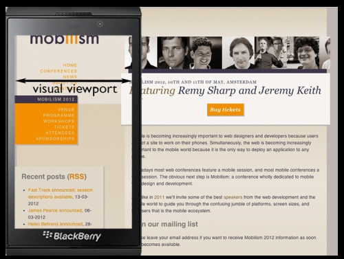

# CSS视口相关

移动端需要注重视口，内核主要是IOS ANDROID

## 1. 设备像素 Device Pixel 简称 DP

设备像素又叫做物理像素、设备物理像素，是显示器(电脑、手机屏幕)最小的物理显示单位，固有属性


1.1 分辨率 Resolution

通常使用分辨率来描述物理像素，如上图，此屏幕的分辨率为1920*1080，表示设备横向有1920个像素点，纵向有1080个像素点

1.2 屏幕尺寸 Screen Size

通常显示器会有一个屏幕尺寸的参数，它是对角线的长度，1英寸大约是2.54厘米，如上图，它的屏幕尺寸为5英寸

1.3 屏幕每英寸的像素点数 Pixels Per Inch 简称 PPI

屏幕每英寸的像素点数也叫屏幕像素密度
    
计算公式: 屏幕像素密度 = 屏幕对角线分辨率 / 尺寸，如上图，它的屏幕像素密度为：√(1920^2+1080^2)/5

1.4 (补充) Dots Per Inch 简称 DPI

早期，这个单位用来描述打印机的性能：打印机能用多少个墨点来打印一寸的内容

主体是打印物

计算公式: 打印物每英寸的点数 = 打印物的对角线分辨率 / 尺寸

区分PPI和DPI: 主语不同

## 2. 设备独立像素 Device Independent Pixel 简称DIP

市面上的显示器种类繁多，相同尺寸的显示器可能分辨率各不相同。此时，如果用物理像素作为单位，设计的同一个元素在相同尺寸不同分辨率上的视觉效果便各不相同。例如：相同尺寸不同分辨率的iPhone3和iPhone4，一个宽160px，高20px的box，在iPhone3(320\*480)上显示是宽度的一半，在iPhone4(640\*960)上则是宽度的1/4，如下图所示


为了解决这个问题，提出了设备独立像素，也叫逻辑像素，用它来设计，这样子相同尺寸的屏幕，不管屏幕的分辨率如何，都能以一样的大小显示。例如iPhone3和iPhone4的设备独立像素都是320，以设备独立像素为单位，最终的视觉效果相同，如下图所示。原因在于1个设备独立像素所拥有的设备像素的数量上：iPhone4是4个物理像素代表1个设备独立像素(横向2个代表1个，纵向2个代表1个)，由此产生了设备像素比这个概念。如下图所示


CSS像素属于设备独立像素中的一种

## 3. 设备像素比 Device Pixel Ratio 简称 DPR

计算公式: 设备像素比 = 物理像素 / 设备独立像素

当设备像素比为1:1时，使用1(1×1)个设备像素显示1个CSS像素；

当设备像素比为2:1时，使用4(2×2)个设备像素显示1个CSS像素；

当设备像素比为3:1时，使用9(3×3)个设备像素显示1个CSS像素

当设备像素比大于或等于2时，称为Retina屏


JS中获取DPR: window.devicePixelRatio

CSS中获取DPR: -webkit-min-device-pixel-ratio / -webkit-max-device-pixel-ratio

## 4. 视觉视口 visual viewport



用户正在看到的网站的区域，也就是移动设备物理屏幕的可视区域，不同设备不同尺寸

## 5. 布局视口 layout viewport


早期，由于移动设备屏幕太小，不能很好地访问网页

后来，移动设备的浏览器默认设置viewport meta标签，定义一个虚拟的布局视口，用于解决页面在移动端的显示问题。大部分移动端浏览器都将这个设置为980px，所以PC上的网页基本能在手机上呈现，只不过元素看上去很小，一般默认可以通过手动缩放网页(Apple 首先提出)

## 6. 理想视口(完美视口) ideal viewport

布局视口的宽度和视觉视口相同时

通过配置viewport meta标签操作布局视口来实现

属性名|值|说明
--|:--:|--
width|正整数或device-width(device-width指设备独立像素)|定义视口的宽度，单位为像素
height|正整数或device-height|定义视口的高度，单位为像素
initial-scale|[0.0-10.0]|定义初始缩放值，相对于理想视口
minimum-scale|[0.0-10.0]|定义缩小最小比例，它必须小于或等于maximum-scale设置，相对于理想视口
maximum-scale|[0.0-10.0]|定义放大最大比例，它必须大于或等于minimum-scale设置，相对于理想视口
user-scalable|yes/no|定义是否允许用户手动缩放页面，默认值yes

width：如果不指定该属性(或移除viewport meta标签)，则布局视口宽度为厂商默认值(大部分为980px)。如果设置为device-width，则此时布局视口的宽度与视觉视口的宽度一致了，形成理想视口。可以通过window.innerWidth取得该值

    <meta name="viewport" content="width=device-width" />

initial-scale：如果将页面缩放比例设置为1，也可以得到理想视口

    <meta name="viewport" content="initial-scale=1.0" />

设置时，最好把width和initial-scale都写上，这是因为兼容问题：width的话苹果不支持，initial-scale的话IE不支持。如果两个同时出现但出现冲突，取当中较大的那个的值


## 7. 自适应布局---定宽640

固定布局视口为640，然后通过缩放布局视口使之成为理想视口

优点: 设计稿是什么尺寸照抄就行，如果设计稿是750则改为750

缺点: 没解决1px问题等

```
// HEAD
有无设置<meta name="viewport">都可以，因为下面JS会判断去进行替代

// SCRIPT
! function (win, doc) {
    var size = 640,
        com = "width=" + size + ", user-scalable=0, minimal-ui, viewport-fit=cover",
        evt = "orientationchange" in win ? "orientationchange" : "resize",
        dpr = win.devicePixelRatio || 1,
        don = doc.documentElement,
        wd, oldWd, scale, cont, vp, mt,
        f = function () {
            wd = Math.min(don.clientWidth, win.screen.width);
            if (oldWd && oldWd === wd) return;
            oldWd = wd;
            scale = wd / size;
            cont = com + ", initial-scale=" + scale + ", maximum-scale=" + scale + ", minimum-scale=" + scale;
            vp = doc.querySelector("meta[name='viewport']");
            if (vp) {
                vp.content = cont;
            } else {
                mt = doc.createElement('meta'), mt.name = "viewport", mt.content = cont, doc.head.appendChild(mt);
            }
        };
        don.setAttribute("data-dpr", dpr), f(), win.addEventListener && win.addEventListener(evt, f, !1);
}(window, document);
```

`size` 设计稿尺寸

`minimal-ui` IOS去掉顶部地址栏和底部导航栏

`viewport-fit` 解决刘海问题，使页面占满整个屏幕

`orientationchange` 移动端提供的横竖屏切换事件

`oldWd` 存放上一次视口的宽度

`if (oldWd && oldWd === wd) return;` resize时，宽度发生变化才重新调整视口，因为resize特殊情况(同时改变长宽，如横竖屏切换)会触发两次

`setAttribute("data-dpr",r)` 可用于解决一些关于DPR的问题，例如1px间隙

## 8. 自适应布局---REM

布局视口定为理想视口

当进入页面时和窗口发生变化时设置REM

缺点: 兼容性问题，设计稿尺寸/100，没解决1px问题等

```
// HEAD
<meta name="viewport" content="width=device-width, initial-scale=1.0, maximum-scale=1.0, user-scalable=no, minimal-ui, viewport-fit=cover">

// SCRIPT
! function (win, doc) {
    var size = 640,
        don = doc.documentElement,
        dpr = win.devicePixelRatio || 1,
        evt = "orientationchange" in win ? "orientationchange" : "resize",
        f = function () {
            var wd = Math.min(don.clientWidth, win.screen.width);
            don.style.fontSize = wd * 100 / size + 'px';
        };
    don.setAttribute("data-dpr", dpr), f(), win.addEventListener && win.addEventListener(evt, f, !1);
}(window, document);
```

`size` 设计稿尺寸

`minimal-ui` IOS去掉顶部地址栏和底部导航栏

`viewport-fit` 解决刘海问题，使页面占满整个屏幕

`orientationchange` 移动端提供的横竖屏切换事件

`setAttribute("data-dpr",r)` 可用于解决一些关于DPR的问题，例如1px间隙

## 9. 自适应布局---REM+VP

结合REM和VP，解决1px问题

当进入页面时和窗口发生变化时:

1. 布局视口定为理想视口宽度的DPR倍，然后缩小1/DPR倍回来

2. 设置REM

```
// HEAD
有无设置<meta name="viewport">都可以，因为下面JS会判断去进行替代

// SCRIPT
! function (win, doc) {
    var size = 640,
        don = doc.documentElement,
        dpr = win.devicePixelRatio || 1,
        scale = 1 / dpr,
        evt = "orientationchange" in win ? "orientationchange" : "resize",
        com = "user-scalable=0, minimal-ui, viewport-fit=cover",
        mt, wd, oldWd, scale, cont, mt, rem,
        f = function () {
            wd = Math.min(don.clientWidth, win.screen.width);
            if (oldWd && oldWd === wd) return;
            oldWd = wd;
            // 重新处理视口
            cont = com + ',width=' + dpr * wd + ',initial-scale=' + scale + ',maximum-scale=' + scale +
                ', minimum-scale=' + scale;
            vp = doc.querySelector("meta[name='viewport']");
            if (vp) {
                vp.content = cont;
            } else {
                mt = doc.createElement('meta'), mt.name = "viewport", mt.content = cont, doc.head
                    .appendChild(mt);
            }
            // 重新计算REM
            rem = dpr * wd * 100 / size + 'px';
            don.style.fontSize = rem;
        };
    don.setAttribute("data-dpr", dpr), f(), win.addEventListener && win.addEventListener(evt, f, !1);
}(window, document);
```

`size` 设计稿尺寸

`minimal-ui` IOS去掉顶部地址栏和底部导航栏

`viewport-fit` 解决刘海问题，使页面占满整个屏幕

`orientationchange` 移动端提供的横竖屏切换事件

`oldWd` 存放上一次视口的宽度

`if (oldWd && oldWd === wd) return;` resize时，宽度发生变化才重新调整视口，因为resize特殊情况(同时改变长宽，如横竖屏切换)会触发两次

`setAttribute("data-dpr",r)` 可用于解决一些关于DPR的问题，例如1px间隙

## 10. VW代替REM计算（不考虑兼容性和1px问题，首选此方法）

1vw = 屏幕可视区宽度的百分之一

用它可以在REM+VP中省去计算REM

示例是没有解决1px问题的，只是简单演示

用法: 设计稿尺寸/100

缺点: 兼容性问题

640设计稿下，HTML: font-size = 宽度 / 6.4 = 100vw / 6.4 = 15.625vw

```html { font-size: 15.625vw; }```

750设计稿下，HTML: font-size = 宽度 / 7.5 = 100vw / 7.5 = 13.33333333vw

```html { font-size: 13.33333333vw; }```